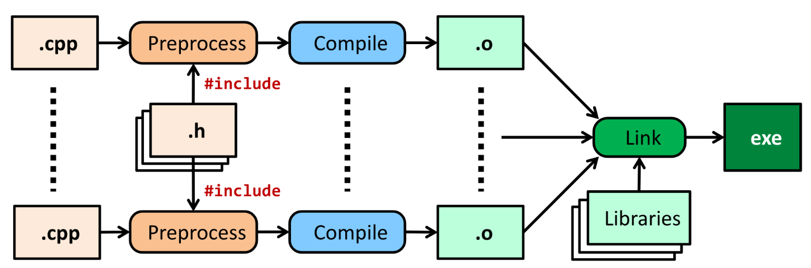
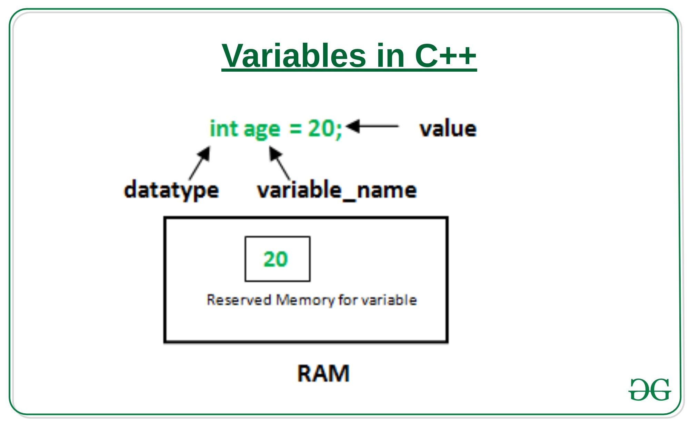
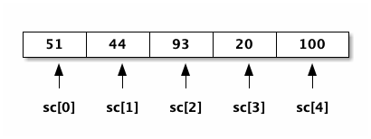
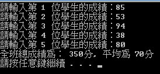
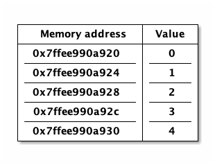

#+Title: Basic Materials of C++
#+OPTIONS: toc:2 ^:nil num:3
#+TAGS: C++
#+PROPERTY: header-args :eval never-export
#+INCLUDE: ../pdf.org
#+EXCLUDE_TAGS: noexport
#+HTML_HEAD: <link rel="stylesheet" type="text/css" href="../css/muse.css" />
#+HTML_HEAD_EXTRA: 
#+begin_export html

#+end_export

* Reasons Why You Should Learn Code in 2023
1. Helping Others[fn:1]:
   By learning how to code, you can use your skills to help people in your own unique way.
   #+CAPTION: 口罩地圖
   #+LABEL:fig:Labl
   #+name: fig:Name
   #+ATTR_LATEX: :width 300
   #+ATTR_ORG: :width 300
   #+ATTR_HTML: :width 400
    
2. In-Demand Skills
   Many employers are increasingly looking for skilled coders who can develop software and applications that meet their needs. Not only does this create more job opportunities for coders, but it also gives them more power to negotiate salaries and perks.
3. Higher Earning Potential
   Coding skills are becoming more in-demand and sought after by employers, allowing those with coding skills to demand higher wages than those without.
4. Increased Problem-Solving Skills
   Learning to code is a great way to increase your problem-solving skills. Computer programming requires you to think logically, develop solutions, and solve complex problems. Plus, coding can help improve your ability to analyze and interpret data. This is useful for any type of work that requires interpreting large amounts of data, such as analytics or machine learning.
5. Improved Communication Skills
   Learning to code can drastically improve your communication skills. Being able to explain and communicate complex ideas in an effective and concise manner is a key skill in many industries. Moreover, coding provides you with a mental framework for breaking down and solving problems. This helps you learn how to think critically and analyze situations in order to come up with the best solution.
資料來源[fn:1]: [[https://devcodecamp.com/2023/02/the-top-5-reasons-why-you-should-learn-code-in-2023/][The Top 5 Reasons Why You Should Learn Code in 2023]]

* 程式的編寫與執行
:PROPERTIES:
:CUSTOM_ID: cpp_execution
:END:
** source code
所謂的程式碼基本上都只是一些文字檔，只是這些文字的撰寫是依照不同語言(如 C、C++、Python、R...)所規定的語法(syntax)來撰寫，以達到特定目的。

** 編寫
既然程式碼只是文字檔，所以，其實我們可以很單純的以 windows 的記事本或是 MacOS 中的 TextEdit 來編寫各種語言的程式碼，只是，使用這些應用程式來編寫程式會相對辛苦，因為相對於一些專用的應用程式如 DevC++、VSCode、PyCharm 等都會提供撰寫者許多的額外功能，例如即時除錯、自動縮排、自動補完(auto complete)，甚至是後續的編譯、執行..。

** 編譯與執行
既然寫完的程式碼只是文字檔，那這些文字檔要如何變成可以執行的執行檔呢？
如下圖[fn:2]所示：

#+CAPTION: C++ Build Model
#+LABEL:fig:Labl
#+name: fig:Name
#+ATTR_LATEX: :width 400
#+ATTR_ORG: :width 300
#+ATTR_HTML: :width 500

程式碼必須先經過 Preprocessing、Compilation、Linking 等步驟才能成為一支可以執行的執行檔(如 Windows 下的.exe 或是 MacOS 下的.app)。

** 幾種寫程式的環境
*** MacOS
- [[https://developer.apple.com/documentation/xcode][Xcode]]
- [[https://code.visualstudio.com/docs/setup/mac][Visual Studio Code]]
*** Windows
**** DevC++
- [[https://progressbar.tw/posts/7][[C語言] 01. Dev C++ 程式編輯器，大一理工學院新生惡夢的開始。]]
- [[http://selfinquiring.hatenablog.com/entry/2016/03/18/204352][Nova的科學反主流學院　]]
**** Code::Blocks
- [[https://blog.csdn.net/DongChengRong/article/details/78624068][安裝BlockCode]]
- [[https://mks.tw/1053/cc-codeblocks-%E8%BC%95%E5%B7%A7%E7%9A%84%E6%95%B4%E5%90%88%E5%BC%8F%E9%96%8B%E7%99%BC%E7%92%B0%E5%A2%83][[C/C++] Code::Blocks 輕巧的整合式開發環境]]
**** Visual Studio Code
- [[https://blog.csdn.net/HelloZEX/article/details/84029810][【VS】VS Code安装、配置、使用（windows10 64）]]
- [[https://tw.alphacamp.co/blog/visual-studio-code-editor-tutorial-and-extensions][VSCode快速安裝教學，推薦常用外掛擴充套件]]
*** 線上 coding 環境
- [[http://cpp.sh/][cpp.sh]]
- [[https://www.jdoodle.com/online-compiler-c++/][JDOODLE]]
- [[https://repl.it/languages/cpp][repl.it]]
- [[https://code.sololearn.com/#cpp][SOLOLEARN]]

#+LATEX:\newpage

* C++基本架構
:PROPERTIES:
:CUSTOM_ID: cpp_arch
:END:

#+begin_src cpp -r -n :results output :exports both
#include <iostream> (ref:header)
using namespace std;

int main() (ref:main)
{
    cout << "Hello world\n"; (ref:cout)
    return 0;
}
#+end_src

#+RESULTS:
: Hello world
** main()
C/C++的程式由許多的 function(函式)組成，function 的基本架構如下：
#+begin_src cpp :eval no
傳回值類型 函式名稱() {
    函式內容
    retrun 傳回值
}
#+end_src
前述程式中的第[[(main)]]行開始即為一名為 main 的 function，這也是 C/C++程式最主要的一支 function，程式被執行時，就由整支程式中找出名為 main 的 function 開始執行。之後我們的程式也將依序寫在這組大括號中。

** 標頭檔(Headers)
上述程式中，第[[(header)]]行為標頭檔(Header)的引入，這裡告訴 Compiler 說我需要用到 iostream 這個 header，原因是程式的第[[(cout)]]行用到 cout 這個指令，而這個指令就被定義在 iostream 這個 header 中，其中的 io 即代表 input/output。

往後如果用到其他函數，也需要 include 相關的 header，例如，如果需要用到數學的開根號函式 sqrt()，就需要 include math.h 這個 header，如下例中的第[[(header)]]行。
#+begin_src cpp -r -n :results output :exports both
#include <iostream>
#include <math.h> (ref:header)
using namespace std;

int main() (ref:main)
{
    cout << sqrt(100) << endl;
    return 0;
}

#+end_src

#+RESULTS:
: 10
** 命名空間(namespace)
一支程式往往會用到許多的指令、函式、變數，不同單位所開發的程式也許會用到相同的名稱來為這些函式或變數命名，如此一來就可能導致名稱的衝突。舉個例子，在一年級新生中，有三個班級裡都有個叫*陳宜君*的同學，那麼我們怎麼區分這三位同學呢？一個方式在提及這些同學時在前面加上班級，如：一年三班的陳宜君。

C++就提出這種方式來解決名稱可能衝突的問題，以下面程式為例：
#+begin_src cpp -r -n :results output :exports both
#include <iostream>
int main() {
    std::cout << "每次用到cout都指定namespace"; (ref:stdcout)
    return 0;
}
#+end_src

#+RESULTS:
: 每次用到 cout 都指定 namespace

上例的第[[(stdcout)]]中的 std::就是 C++的標準命名空間，用來說明這裡所用的 cout 是 C++預設的指令，但是如果你並沒有命名衝突的問題，其實可以一開始就直接把 namespace 設定為 std，如下面程式中的第[[(namespace)]]行。
#+begin_src cpp -r -n :results output :exports both
#include <iostream>
using namespace std; (ref:namespace)
int main() {
    cout << "用到cout時不用再特別指定namespace"; (ref:stdcout)
    return 0;
}
#+end_src

#+RESULTS:
: 用到 cout 時不用再特別指定 namespace

有關於 namespace 的詳細說明，可參考[[https://openhome.cc/Gossip/CppGossip/Namespace.html][簡介名稱空間]]以及[[https://stackoverflow.com/questions/37693999/use-a-function-in-different-file-and-different-namespace-in-visual-c][Use a function in different file and different namespace in Visual C++]]這兩篇文章。
#+LATEX:\newpage

* 輸出
:PROPERTIES:
:CUSTOM_ID: cpp_output
:END:
顧名思意，輸出是將資料輸出到某種設備（如螢幕、印表機...）, 常見的輸出指令有 cout、printf()、puts()、putchar()等。
** cout
cout 為 iostream 這個類別(class)的 object[fn:3]，所以程式中若使用到 cout 就必須 include iostream。cout 可以將文字資料與變數資料列印在螢幕上，在語法上會使用<<作為文字與變數之間的連接工具，若要換行則使用"\n"或是關鍵字 endl[fn:4]。

如果要輸出的是文字資料，則應該在文字的前後各加上英文的雙引號(")，如下列程式的第[[(helloWorld)]]行，不同類型的數值資料間要以<<間隔。

#+begin_src cpp -r -n :results output :exports both
#include <iostream>
using namespace std;
int main() {
    cout << "Hello world\n"; (ref:helloWorld)
    cout << "半徑：" << 3 << endl;
    cout << "圓面積：" << 3*3*3.1416 << "\n";
    return 0;
}
#+end_src

#+RESULTS:
: Hello world
: 半徑：3
: 圓面積：28.2744

** printf()
:PROPERTIES:
:CUSTOM_ID: cpp_printf
:END:
printf()為定義在 stdio.h 中的一個 function，所以若用到 printf()就要 include stdio.h。

和 cout 一樣，printf()一樣是用來進行資料的輸出，只是在輸出時提供了更多的格式選定選項。基本的應用如下例，更複雜的應用則在介紹完變數(vairalbe)概念後再行說明。
#+begin_src cpp -r -n :results output :exports both

#include <stdio.h>
using namespace std;
int main() {
    printf("Hello world\n");
    printf("半徑：%d\n", 3);  //%d表示在該處要顯示/輸出一個整數
    printf("圓面積：%.2f\n", 3*3*3.1416); //%.2f: 表示在該處要顯示/輸出一個小數，精確度達到小點點後第二位
    return 0;
}
#+end_src

#+RESULTS:
: Hello world
: 半徑：3
: 圓面積：28.27
*** float v.s. double
在 C++ 中，使用 printf() 函數輸出 double 或 float 變數時，可以使用格式化字符串指定輸出的格式。對於 float 和 double 變數，常用的格式化符號是 %f 或 %lf。
- %f：用於輸出 float 或 double 型別的變數。
- %lf：雖然在 C 語言中 %lf 是用來輸出 double 的格式，但在 C++ 的 printf() 函數中，%f 和 %lf 是等效的，因為 printf() 不區分 float 和 double，它們都會被轉換為 double 進行處理。
#+begin_src cpp -r -n :results output :exports both
#include <iostream>

int main() {
    float a = 3.14159f;
    double b = 2.718281828459;

    // 使用 printf() 輸出 float 和 double
    printf("float 變數 a = %f\n", a);
    printf("double 變數 b = %f\n", b);

    // 限制小數點後兩位
    printf("float 變數 a (兩位小數) = %.2f\n", a);
    printf("double 變數 b (兩位小數) = %.2f\n", b);

    return 0;
}
#+end_src
** 跳脫字元
如果你試過利用 C++來輸出下列這段話：
#+begin_verse
他說："好"，然後他就死了。
#+end_verse
你會發現這是件困難的事，在前節的 cout 中，我們提及雙引號是用來將文字括起來的符號，若在字串中也出現雙引號，則勢必會打亂雙引號在文字中的規則。要輸出這類特殊字元的問題，有以下兩種方法：
*** cout + 單引號
以兩個單引號將雙引號括起來，如下列程式。
#+begin_src cpp -r -n :results output :exports both
#include <iostream>
using namespace std;
int main() {
    cout << "他說："<< '"' << "好" << '"' << "，然後他就死了。\n";
}
#+end_src

#+RESULTS:
: 他說："好"，然後他就死了。
*** 加上跳脫字元
即，在字串中的雙引號前加上\，變成\"，如下
#+begin_src cpp -r -n :results output :exports both
#include <iostream>
using namespace std;
int main() {
    cout << "他說：\"好\"，然後他就死了。\n";
}
#+end_src

#+RESULTS:
: 他說："好"，然後他就死了。

常用的跳脫字元還有以下幾類：
| 字元 | 意義                                |
| \'                       | 單引號                    |
| \"                       | 雙引號                    |
| \\                       | 反斜線                    |
| \0                       | 空字元(NULL)              |
| \t                       | 定位字元(TAB)   |
| \n                       | 換行字元(ENTER) |

* Variable
:PROPERTIES:
:CUSTOM_ID: cpp_variables
:END:
** 關於變數
A variable is a name given to a memory location. It is the basic unit of storage in a program[fn:5].
- The value stored in a variable can be changed during program execution.
- A variable is only a name given to a memory location, all the operations done on the variable effects that memory location.
- In C++, all the variables must be declared before use.

** <<VarDec>>變數的宣告與應用
變數是資料的標籤，而非資料本身。電腦程式很大一部分是在操作資料，變數在本質上是用來操作資料的一種語法特性。[fn:6]
#+CAPTION: Variables in C++
#+LABEL:fig:vic
#+name: fig:vic
#+ATTR_LATEX: :width 400
#+ATTR_ORG: :width 400
#+ATTR_HTML: :width 400

C 語言的變數宣告語法如下：
#+begin_src  :eval no
變數類型 變數名稱[=初值];
#+end_src
以下列程式為例，第[[(decInt)]]行宣告了一個名為 r 的整數型態(int)變數，這意謂著向記憶體要了塊足以儲存整數資料的空間，並將之命名為 r，並在第[[(assignInt)]]將整數 5 存入這個空間中，爾後只要在程式中提及 r，指的便是 5 這個值。這裡的等號運算子其作用為指定(assign)，即是將等號*右邊*的值存入等號*左邊*的變數(空間)中。

在第[[(decDouble)]]行宣告了一個名為 cirArea 的小數變數，接下來在第[[(assignDouble)]]行先計算出圓面積的值，再把這個值存入這個小數變數空間中。
#+BEGIN_SRC C++ -n -r :results output :exports both
#include <iostream>
using namespace std;
int main() {
    int r; (ref:decInt)
    double cirArea; (ref:decDouble)
    r = 5; (ref:assignInt)
    cirArea = r * r * 3.1416; (ref:assignDouble)
    cout << "圓面積：" << cirArea << endl;
}
#+END_SRC

#+RESULTS:
: 圓面積：78.54

** 變數的命名規則
1. 可用字母、數字、底線。
2. 第一個字不可為數字，如 1x, 2x...，可以為 x1, x2...。
3. 名稱間不可有空白。如 student no，可以 student_Id 或是 studentId 取代。
4. 大小寫有別(Case-Sensitive): a 與 A 為兩個不同的變數。
5. 不可使用關鍵字(如 int, double, if, while...)。
6. 底線開頭接大寫字母應保留給系統使用。
更詳細的命名規範與建議可參閱：[[https://www.itread01.com/content/1541214186.html][C語言中變數名及函式名的命名規則與駝峰命名法]]。

** 變數類型
:PROPERTIES:
:CUSTOM_ID: cpp_variable_types
:END:
前節介紹了變數的宣告要先說明其類型，根據要儲存的資料種類不同，C++變數有許多型態。以下是一些常用的基本型態[fn:7]：
| 型態 | 中文意思                                              | 英文字義 | 可儲存的資料 |
| int                      | 整數                                                                      | Integer                                          | 100、-5、1246 ...                                    |
| float                    | 32 bit 單精浮點數(小數) | single precision floating point                  | 3.14159、4.3、-1.1 ...                               |
| double                   | 64 bit 倍精浮點數(小數) | double precision floating point                  | 3.14159、4.3、-1.1 ...                               |
| char                     | 字元(半形字)                                | Character                                        | 'a'、'R'、'1'、'@'、'*' ...      |
| string                   | 字串(文句)                                            | String                                           | "Hello"、"^_^"、"Rock!" ...                          |
| bool                     | 布林(是非)                                            | boolean                                          | true、false                                                    |
關於 float 與 double 的進一步說明，可參閱：[[https://taichunmin.pixnet.net/blog/post/27827769][float跟double小知識]]。

** 變數的極限
*** 範例
#+begin_src cpp -r -n :results output :exports both
#include <iostream>
#include <float.h>
using namespace std;
int main() {
    cout << INT_MIN << endl;
    cout << INT_MAX << endl;
    cout << LONG_MIN << endl;
    cout << LONG_MAX << endl;
    cout << DBL_MIN << endl;
    cout << DBL_MAX << endl;
}
#+end_src

#+RESULTS:
: -2147483648
: 2147483647
: -9223372036854775808
: 9223372036854775807
: 2.22507e-308
: 1.79769e+308

*** 詳細內容：
[[https://en.cppreference.com/w/c/types/limits]]

* 輸入
:PROPERTIES:
:CUSTOM_ID: cpp_input
:END:

** 變數的輪入
前節提及變數的宣告、指定內容以及輸出變數，然而在程式內容中指定變數值實在很沒有彈性，我們可以透過輸入(cin)的方式將指定變數值的時機延後到程式執行時，由使用者來指定，例如：

#+begin_src cpp -r -n :eval no
#include <iostream>
using namespace std;
int main() {
    double r;
    double area;
    cin >> r; (ref:cinr)
    area = r * r * 3.14; (ref:carea)
    cout << "半徑 " << r << "的圓，其面積為: " << area << "\n";
}
#+end_src

程式在執行至第[[(cinr)]]行中的 cin 時會暫停，等待使用者自鍵盤輸入一數值，並將該數值存入變數 r 中，接下來再以這個 r 來計算圓面積(第[[(carea)]]行)，最後輸出其面積。

** 一個以上的變數輸入
如果要輸入多個變數，可以採以下兩種方式(類似 cout 的做法)
*** 分開 cin
#+begin_src cpp -r -n :eval no
//...
int x, y, z;
cin >> x;
cin >> y;
cin >> z;
//...
#+end_src

*** 以>>串接
#+begin_src cpp -r -n :eval no
//...
int x, y, z;
cin >> x >> y >> z;
//...
#+end_src

* 運算式
:PROPERTIES:
:CUSTOM_ID: cpp_operation
:END:
** 指定運算
最基本的運算子為=(assign)，即，將資料(數值、字元或字串)存入某變數空間中，如:
#+begin_src cpp -r -n :results output :exports both
#include <iostream>
using namespace std;
int main() {
    int x, y, z;
    x = 3;
    y = 4;
    z = x + y; (ref:zxy1)
    cout << z << endl;
    x = 10;
    z = x + y; (ref:zxy2)
    cout << z << endl;
}

#+end_src

#+RESULTS:
: 7
: 14

指定運算除了可以將其他變數的計算結果存入變數中(如上述程式中的第[[(zxy1)]]、[[(zxy2)]]行)外，也可以將變數本身的值再運算後存回來，如：
#+begin_src cpp -r -n :results output :exports both
#include <iostream>
using namespace std;
int main() {
    int x;
    x = 3;
    cout << x << endl;
    x = x + 1; (ref:xx1)
    cout << x << endl;
    x++; // 同x = x + 1 (ref:xpp)
    cout << x << endl;
    x = x * 3; (ref:xx3)
    cout << x << endl;
}

#+end_src

#+RESULTS:
: 3
: 4
: 5
: 15

如同[[VarDec]]所述:
#+begin_verse
等號運算子其作用為指定(assign)，即是將等號*右邊*的值存入等號*左邊*的變數(空間)中
#+end_verse
，上述程式中的第[[(xx1)]]行是先求出 x+1 的值(4)，再將這個值存回變數 x 中，這個運算也可以第[[(xpp)]]取代；同理，程式中的第[[(xx3)]]行是先將 x 的值乘以 3，再把結果存回變數 x 中。

** 數值運算
C/C++的基本數值運算有+、-、*、/、%，最後的%為取餘數。
#+begin_src cpp -r -n :results output :exports both
#include <iostream>
using namespace std;
int main() {
    int x = 10, y = 3;
    cout << x + y << endl;
    cout << x - y << endl;
    cout << x * y << endl;
    cout << x / y << endl; (ref:xdy)
    cout << x % y << endl; (ref:xmy)
}
#+end_src

#+RESULTS:
: 13
: 7
: 30
: 3
: 1

此處須留意的是第[[(xdy)]]行的值為整除的結果(得到商)，因為 x 與 y 均為整數，故此處的/為整除；此外，第[[(xmy)]]的%運算僅能用於 x 與 y 均為整數的狀況，在 C/C++中，小數不允許有取餘數的運算(python 可以)。

數除運算也可以結合小括號來進行更複雜的運算，如：
#+begin_src cpp -r -n :eval no
//...
int t = 10;
double up = 10.3;
double bt = 20.4;
double height = 15;
double area;
area = ((up + bt) * height / 2) * 10;
// ...
#+end_src

此處須留意，小刮號可以層層相叠，但不能像數學式那樣最內層為小括號、然後是中刮號、大刮號...

*** 進階運算
C++也提供一些較複雜的數學運算如開根號、log、或是 sin、cos 等，但使用時必須 include 函式庫(math.h)
- 開根號
#+begin_src cpp -r -n :results output :exports both
#include <iostream>
#include <stdio.h>
#include <math.h> //一定要匯入
using namespace std;

int main() {
    int n;
    double ans;
    n = 10;
    ans = sqrt(n);
    cout << ans << endl;
    printf("%.2f\n", ans);
}
#+end_src

#+RESULTS:
: 3.16228
: 3.16

** 關係運算
:PROPERTIES:
:CUSTOM_ID: cpp_cond_operation
:END:
即，比較兩個值(或運算式)的結果，可的關係運算子如下：
| 關係運算子 | 意義                         | 使用範例 | 範例運算結果 |
| ==                                                           | 等於                         | 1+1 == 2                                         |                                                                        1 |
| !=                                                           | 不等於             | 3 != 4                                           |                                                                        1 |
| >                                                            | 大於                         | 5 > 7                                            |                                                                        0 |
| >=                                                           | 大於等於 | 3 >= 5                                           |                                                                        0 |
| <                                                            | 小於                         | 2 < 6                                            |                                                                        1 |
| <=                                                           | 小於等於 | 8 <= 8                                           |                                                                        1 |

** 條件運算
上述關係運算所得的條件值(true/false)也可以再進行運算，而運算的結果也只有兩類: true/false。最基本的條件運算有以下三項：
*** &&, and
且，只有在兩項條件均成立時其運算結果才是 true，否則其結果為 false，如
#+begin_src cpp -r -n :results output :exports both
#include <iostream>
using namespace std;
int main() {
    int x = 3;
    int y = 4;
    cout << (x >= 3 && y >= 0) << endl;
    cout << (x == 3 && y > 4) << endl;
}
#+end_src

#+RESULTS:
: 1
: 0

*** ||, or
#+begin_src cpp -r -n :results output :exports both
#include <iostream>
using namespace std;
int main() {
    int x = 3;
    int y = 4;
    cout << (x >= 3 || y < 0) << endl;
    cout << (x != 3 && y > 14) << endl;
}
#+end_src

#+RESULTS:
: 1
: 0

*** !, not
#+begin_src cpp -r -n :results output :exports both
#include <iostream>
using namespace std;
int main() {
    int x = 3;
    int y = 4;
    cout << !(x >= 3) << endl;
    cout << !(x == 3 && y > 4) << endl;
}
#+end_src

#+RESULTS:
: 0
: 1

如果數值運算，條件運算也結合小刮號進行更複雜的計算。

* if 條件判斷
:PROPERTIES:
:CUSTOM_ID: cpp_ifelse
:END:
if 判斷式可用來判斷條件是否成立，並且依照條件之成立與否，來執行不同的程式碼[fn:8]。依照條件的複雜程度可大致分為以下三類：

** 單一條件
*** 語法
最簡單型式的條件式如下，即，當條件成立，則執行程式碼。
#+begin_src cpp :eval no
if (條件) {
    程式碼;
}
#+end_src

*** 範例
若分數及格，則輸出 PASS
#+begin_src cpp -r -n :results output :exports both
#include <iostream>
using namespace std;
int main() {
  int score;
  score = 87;
  if (score >= 60) {
      cout << "PASS\n";
  }
}
#+end_src

#+RESULTS:
: PASS

*** 課堂練習
:PROPERTIES:
:CUSTOM_ID: CPP_ifelse_practice1
:END:
**** A: 輸入一整數，判斷正負，輸出結果。
***** 測資 1
- 輸入: 3
- 輸出: 3>0
***** 測資 2
- 輸入: -4
- 輸出: -4<0
**** B: 輸入一整數，判斷奇偶，輸出結果。
***** 測資 1
- 輸入: 3
- 輸出: The number 3 is odd.
***** 測資 2
- 輸入: -4
- 輸出: The number -4 is even.

** 條件運算(條件的組合)
在前節的範例中，我們看到的是最簡單的條件，如
#+begin_src cpp -r -n :eval no
if (score >= 60) {
    ...
}
#+end_src
然而，更多時候我們要處理的是多種條件的組合，例如：輸入一分數，若所輸入的分數不合理(大於 100 或小於 0)，則輸出"請重新輸入"。雖然我們可以利用以下的寫法來解決問題：
#+begin_src cpp -r -n :eval no
#include <iostream>
using namespace std;
int main() {
  int score;
  score = -19;
  if (score < 0) {
      cout << "請重新輸入\n";
  }
  if (score > 100) {
      cout << "請重新輸入\n";
  }
}
#+end_src
但更適合的是利用條件運算來處理問題，如下：
#+begin_src cpp -r -n :results output :exports both
#include <iostream>
using namespace std;
int main() {
  int score;
  score = -19;
  if ((score < 0) || (score > 100)) {
      cout << "請重新輸入\n";
  }
}
#+end_src

#+RESULTS:
: 請重新輸入

上述的||即為條件運算子，代表 OR。

C++的條件運算子列表如下：
| 運算子 | 名稱 | 範例                                            | 說明                                                                                                                                                     |
| &&                                   | AND                      | ( 條件 1 && 條件 2)         | 當條件 1、2 皆成立時才算成立                         |
| \vert\vert                           | OR                       | ( 條件 1 \vert\vert 條件 2) | 只要條件 1、2 有一項成立就算成立 |
| !                                    | Not                      | !（條件 1)                            | 當條件 1 不成立時就成立                                                  |

** 雙重條件
*** 語法
若條件的可能性可分為兩類，則可使用如下 if..else..的條件式，即:
- 當條件成立，則執行程式碼一，
- 否則(若條件不成立)，則執行程式碼二。
#+begin_src cpp :eval no
if (條件) {
    程式碼一;
} else {
    程式碼二;
}
#+end_src

*** 範例
若分數及格，則輸出 PASS，否則輸出 FAIL
#+begin_src cpp -r -n :results output :exports both
#include <iostream>
using namespace std;
int main() {
  int score;
  score = 57;
  if (score >= 60) {
      cout << "PASS\n";
  } else {
      cout << "FAIL\n";
  }
}
#+end_src

#+RESULTS:
: FAIL
*** 課堂練習
**** A: 輸入一元二次方程式 \(ax^2+bx+c=0\) 中的 a,b,c 三參數，判斷此方程式是否有實數解，若有，則輸出 X exists.；若無實數解，則輸出 X does not exist.
***** 測資 1
- 輸入: 1 3 -10
- 輸出: X exists.
***** 測資 2
- 輸入: 1 2 3
- 輸出: X does not exist.

** 巢狀條件
上節中提及若 if 後的件條成立，則執行大括號中的程式碼，此段程式碼也可以是 if 條件本身，如：
*** 語法
#+begin_src cpp :eval no
if (條件1) {
    程式碼...;
    if (條件2) {
        程式碼...;
    }
    程式碼...;
} else {
    程式碼...;
}
#+end_src
*** 範例
#+begin_src cpp -r -n :results output :exports both
#include <iostream>
using namespace std;
int main() {
    int pass;
    cin >> pass;
    bool userIsAdmin = true;
    if (pass == 1234) {
        if (userIsAdmin == true) {
            cout << "管理者，有root權限";
        } else {
            cout << "為一般使用者，權限有限";
        }
    } else {
        cout << "輸入密碼錯誤";
    }
}
#+end_src
*** 課堂練習
**** A: 輸入一分數，若該分數合理(介於 0~100 間`)，則繼續判斷是否及格，若及格則輸出 PASS，若不及格則輸出 FAIL；若該分數不合理，則輸出: Invalid score。
***** 測資 1
- 輸入: 30
- 輸出: FAIL
***** 測資 2
- 輸入: 300
- 輸出: Invalid score
***** 測資 3
- 輸入: 99
- 輸出: PASS

** 多重條件
:PROPERTIES:
:CUSTOM_ID: cpp_multi_conditions
:END:
*** 語法
- 當要判斷的條件可能性超過兩種，則可以用如下的 if..else if..條件式，即，
- 當條件一成立，則執行程式碼一；
- 若條件一不成立，則繼續判斷條件二，若條件二成立，則執行程式碼二；
- 若條件二也不成立，則繼續判斷條件三...依此類推。
- 最後的 else(第[[(else)]]行則可有可無，若有，則表示如果以上所有條件皆不成立，則執行程式碼 N。
#+begin_src cpp :eval no
if (條件一) {
    程式碼一;
} else if (條件二) {
    程式碼二;
} else if (條件三) {
    程式碼三;
} ... {

} else { (ref:else)
    程式碼N
}
#+end_src
*** 範例
將分數轉成等第(A, B, C...)
#+begin_src cpp -r -n :results output :exports both
#include <iostream>
using namespace std;
int main() {
    int score = 79;
    if (score >= 90) {
        cout << "A\n";
    } else if (score >= 80) {
        cout << "B\n";
    } else if (score >= 70) {
        cout << "C\n";
    } else if (score >= 60) {
        cout << "D\n";
    } else {
        cout << "F\n";
    }
}
#+END_SRC

#+RESULTS:
: C

* For Loops
:PROPERTIES:
:CUSTOM_ID: cpp_for_loop
:END:
計算機的優勢除了運算速度之快，更重要的是它十分適合拿來做一些重複性極高的工作，例如，幫所有同學計算月考平均、幫全國所有家庭計算須繳所得稅....，For 迴圈即是許多語言用來執行重複工作的指令。
** 語法 1 (要重複的程式碼只有一行時)
#+begin_src cpp -r -n :eval no
for (初始值; 條件式; 更新值) 程式碼;
#+end_src
** 語法 2 (要重複一行以上程式碼時)
#+begin_src cpp -r -n :eval no
for (初始值; 條件式; 更新值){
    程式碼一;
    程式碼二;
    ...
}
#+end_src

*初始值* 是進入迴圈一開始會執行的動作，而 *更新值* 則是執行完每次的迴圈要執行的動作，至於重複的次數則取決於 *條件式* 是否成立，只要 *條件式* 一直成立(其計算結果為 true)，則持續重複執行程式碼；所以要利用 *更新值* 來逐步修正，讓條件值有機會傳回 false。
** 範例
#+begin_src cpp -r -n :results output :exports both
#include <iostream>
using namespace std;

int main() {
    for (int i = 1; i < 10; i++) { (ref:fori1)
        cout << "3 * " << i << " = "  << 3*i << endl;  (ref:fori2)
    }
    return 0; (ref:return)
}
#+end_src

#+RESULTS:
: 3 * 1 = 3
: 3 * 2 = 6
: 3 * 3 = 9
: 3 * 4 = 12
: 3 * 5 = 15
: 3 * 6 = 18
: 3 * 7 = 21
: 3 * 8 = 24
: 3 * 9 = 27

以上述程式為例，其程式執行的步驟如下：
1. 令迴圈變數 i=1，這個 *初始值* 只會執行一次(第[[(fori1)]]行)
2. 檢查 *條件式* i<10 是否成立，若不成立則跳出迴圈 ( 即跳至第[[(return)]]行 )
3. 若 *條作式* 成立，則執行第[[(fori2)]]行，輸出一行結果
4. 執行 *更新值* i++; ( 即 i=i+1; )將迴圈變數的值逐步加大，使其有機會違反 *條件式* (即結束迴圈)
5. 跳至 2. 的位置重複本步
** 練習
1) 輸入 n，輸出所有小於 n 的偶數．
2) 輸入 n，輸出所有小於 n 且可被 17 整除的數．
3) 輸入一數 N，輸出 1+2..+N
** 旗標變數
:PROPERTIES:
:CUSTOM_ID: flag_variable
:END:
有時我們希望能在迴圈的過程中判斷「某事是否曾發生過」，例如，「是否曾發現某數的因數？」、「連續輸入 N 個分數，判斷這 N 個分數中是否至少有一科不及格？」這是我們的思考方式就要稍做轉變。
*** 例題
小明買了 N 張單碼彩卷，問是否全部摃龜，若這 N 張彩卷中至少有一張中奬(號碼=77)，則輸出"NOT BAD"，否則輸出"QQ"。
*** 想法 1
面上述要求，for 迴圈的初學者可能會想在 for 中直接判斷中奬與否，如下:
#+begin_src cpp -r -n :results output :exports both :cmdline < for-in.txt
#include <iostream>
using namespace std;
int main() {
    int n;
    cin >> n;
    int x;
    for (int i = 1; i <= n; i++) {
        cin >> x;
        if (x == 77) {
            cout << "NOT BAD\n";
        } else {
            cout << "QQ\n";
        }
    }
}
#+end_src

#+RESULTS:
: QQ
: NOT BAD
: QQ
由上述結果可以發現，這並不是正確答案，很顯然應該把輸出判斷放在 for 的後面，那，要如何做到這點呢？
*** 想法 2
另一種做法是，我們可以在 for 裡去計算中奬的次數，等到全部輸入完畢後，最後再統計一共有幾張中奬，這樣就可以解決上述問題：
#+begin_src cpp -r -n :results output :exports both :cmdline < for-in.txt
#include <iostream>
using namespace std;
int main() {
    int n;
    cin >> n;
    int x;
    int numOfWins = 0;
    for (int i = 1; i <= n; i++) {
        cin >> x;
        if (x == 77) {
            numOfWins++;
        }
    }
    if (numOfWins > 0) {
        cout << "NOT BAD\n";
    } else {
        cout << "QQ\n";
    }
}
#+end_src

#+RESULTS:
: NOT BAD
回顧一下這個做法，其實我們會發現我們到最後根本不在乎有幾張彩卷中奬，我們只在乎有沒有中過奬，即，對我們而言，numOfWins 其實只有兩種值:
- 0
- 大於 0
既然如此，其實以 boolean 變數來表示它會更為恰當。
*** 想法 3
#+begin_src cpp -r -n :results output :exports both :cmdline < for-in.txt
#include <iostream>
using namespace std;
int main() {
    int n;
    cin >> n;
    int x;
    bool iWin = false;
    for (int i = 1; i <= n; i++) {
        cin >> x;
        if (x == 77) {
            iWin = true;
        }
    }
    if (iWin) {
        cout << "NOT BAD\n";
    } else {
        cout << "QQ\n";
    }
}
#+end_src

#+RESULTS:
: NOT BAD
這裡的 iWin 就是典型的 Flag variable。
** 作業 :noexport:
*** 鞭在手，問天下誰是英雄？
**** 應俱備能力
基本迴圈結構
**** 程式要求說明
- 鞭有單、雙、軟、硬之分，其質有銅、鐵、鐵木、純木之別
- 閃電五連鞕：源自金龍鞭法，而金龍鞭法原為為江南七怪中的老三、「馬王神」韓寶駒的成名絕技。其鞭法招式注重巧勁，練習時若用錯勁力，反而先傷己身。然江山代有才人出，金龍鞭法經揚名中國傳統武術圈的「渾元形意太極拳掌門人」馬保國改造後，化有形為無形，以人為鞭，達到「人即鞭、鞭即人、人鞭一體」之境，江湖人稱人鞭宗師。
- 自從 5 月 17 日在一場名為「演武堂之江湖十六」的比賽中遭 50 歲的搏擊愛好者王慶民 3 次 KO 後，馬保國痛定思痛，閉關三日苦思五連鞕心法，出關後再創進階版的閃電 N 連鞭，此鞭法精妙之處在於可以連續叠加 N 層，猶如大海浪潮一波又一波，練至化境，龍吟之聲不斷，頗有與金龍之名相互呼應之勢。
- 此鞭法所能造成之殺傷力與使鞭之人功力有關，若使鞭人功力值為 m，則：
  + 第 1 鞭所能造成之殺傷力點數為 m*(1*m)^2 點；
  + 第 2 鞭所能造成之殺傷力點數為 m*(2*m)^2 點；
  + 第 3 鞭所能造成之殺傷力點數為 m*(3*m)^2 點；
  + 依此類推
- 輸入：讀入使鞭者功力 m 以及連使之鞭數 n
- 輸出：第 1 至 n 鞭所造成之傷害值
**** 輸入/輸出範例
- 輸入 1
  10
  190800
- 輸出 1
  1: 190801
  2: 190802
  3: 190803
  4: 190804
  5: 190805
  6: 190806
  7: 190807
  8: 190808

* Nested For Loop
:PROPERTIES:
:CUSTOM_ID: cpp_nested_for
:END:
** 語法
#+begin_src cpp -r -n :eval no
for (初始值1; 條件式1; 更新值1) {
    ...
    for (初始值2; 條件式2; 更新值2) {
        程式碼一;
        程式碼二;
        ...
    }
    ...
}
#+end_src
** 範例
#+begin_src cpp -r -n :results output :exports both
#include <iostream>
using namespace std;

int main() {
    int i, j;
    for (i = 0; i < 3; i++) { (ref:outer-for11)
        for (j = 1; j <= 5; j++) { (ref:iner-for21)
            cout << "*";
        } (ref:iner-for22)
        cout << endl;
    } (ref:outer-for12)
}
#+end_src

#+RESULTS:
: *****
: *****
: *****

如同 if 可以有巢狀結構，for 的重複程式碼中也可以有 for 結構，上述的外層 for 迴圈(第[[(outer-for11)]]行到第[[(outer-for12)]]行)每重複一次，內層 for 迴圈(第[[(iner-for21)]]行到第[[(iner-for22)]]行)就會重複 5 次。
** 課堂練習
*** 輸入 x,y，輸出一由*構成、長為 x、寛為 y 的長方形，若 x=3, y=5，則輸出：
#+BEGIN_EXAMPLE
***
***
***
***
***
#+END_EXAMPLE
*** 輸入 n，若 n=5，輸出如下三角形:
#+BEGIN_EXAMPLE
*
**
***
****
*****
#+END_EXAMPLE
*** 輸入 n，若 n=5，輸出如下三角形:
#+BEGIN_EXAMPLE
*****
****
***
**
*
#+END_EXAMPLE
*** 輸入 n，若 n=5，輸出如下三角形:
#+BEGIN_EXAMPLE
1
22
333
4444
55555
#+END_EXAMPLE

* While
:PROPERTIES:
:CUSTOM_ID: cpp_while
:END:
** While
*** 語法
#+begin_src cpp -r -n :eval no
while( 條件式1 ) {
    程式碼1;
    程式碼2;
}
#+end_src
while 與 for 均為重複結構，比較起來，while 的語法結構更為簡單，但撰寫者要自行處理的事也更多一些。上述語法的執行流程為:
1. 若 while 後的 *條件 1* 成立，則執行一次大括號內的所有程式碼
2. 回到 1.
由上述結構也可以看出，我們必須想辦法讓 *條件 1* 有機會不成立，否則這個 while 迴圈就會一直重複下去。
*** 範例 1
以 while 模擬 for loop
#+begin_src cpp -r -n :results output :exports both
##include <iostream>
using namespace std;
int main(int argc, char *argv[]) {
    int i;

    while (i<= 5) {
        cout << "This is a while test\n;"
        i++;
    }

    return 0;
}
#+end_src
*** 範例 2
九九乘法表
#+begin_src cpp -r -n :results output :exports both
#include <iostream>
using namespace std;

int main() {
    int i = 9;
    while (i > 0) {
        cout << "3 * " << i << " = " << 3*i << endl;
        i--;
    }
    return 0;
}
#+end_src

#+RESULTS:
: 3 * 9 = 27
: 3 * 8 = 24
: 3 * 7 = 21
: 3 * 6 = 18
: 3 * 5 = 15
: 3 * 4 = 12
: 3 * 3 = 9
: 3 * 2 = 6
: 3 * 1 = 3
*** 課堂練習
- 輸入一整數 n，輸出\(\)\(\sum{n}\)，以 while 完成。

** 不固定次數的重複
有些時候你想重覆執行某些動作，但是你又不確定會重覆多少次，典型的例子是輸入密碼，輸入錯誤後就應該重新輸入，作為系統設計者，你不會知道使用者會在第幾次輸入正確密碼，這就是 while 適合上場的時機....，例如:
#+begin_src cpp -r -n :results output :exports both
輸入密碼;
while(密碼錯誤)
{
    輸入密碼;
}
#+end_src
*** 課堂練習
- 系統登入檢查:模擬作業系統登入畫面，進行使用者密碼檢查，當輸入輸入正確密碼後秀出畫面，否則持續要求輸入密碼
- \(n!\)的值為 1*2*3*....*n，請問 n 最大到多少時，\(n!\)的人值才會開始超過 200000 ？

** Do ... while
有些狀況下，重複的次數 *至少* 要發生一次才行，例如前節中的密碼檢查，使用者至少要先輸入一次密碼，接下來系統才能針對密碼進行驗證，此時，do..while 會是一個比較理想的重複架構，其語法如下：
#+begin_src cpp -r -n :results output :exports both
do {
    輸入密碼
} while (密碼錯誤);
#+end_src
比起前一節的 while，是不是更為精簡了呢....

* Array
:PROPERTIES:
:CUSTOM_ID: cpp_arrays
:END:
直至目前為止，我們學過宣告變數來儲存數值(int, double)，如果今天要計算全班資訊科成績平均(5 人)，也許我們可以用如下方式來計算:
#+begin_src cpp -r -n :results output :exports both
int main(int argc, char *argv[]) {
    int cs1, cs2, cs3, cs4, cs5;
    std::cin >> cs1 >> cs2 >> cs3 >> cs4 >> cs5;

    double avg;
    avg = (cs1 + cs2 + cs3 + cs4 + cs5) / 5.0;

    std::cout << avg << endl;
    return 0;
}
#+end_src

but....如果全班有 50 個人呢？如果是要求全校的成績分佈呢?

各種程式語言為了因應這種大批資料的處理計算，都會有相對應的資料結構，C++的陣列(array)就是用來儲存大量資料的結構。
** 基本操作
*** 宣告
如果變數一樣，array 也要先宣告才能使用，其宣告方式如下：
#+begin_src cpp -r -n :results output :exports both
資料型態 名稱[長度];
#+end_src
其中陣列長度必須為一編譯時期的常數，例如:
#+begin_src cpp -r -n :results output :exports both
int number[10];    // 宣告 10 個元素的整數陣列
double score[10];  // 宣告 10 個元素的浮點數陣列
char ascii[10];    // 宣告 10 個元素的字元陣列
#+end_src
或是
#+begin_src cpp -r -n :results output :exports both
int numOfStudent;
cin >> numOfStudent; //先確認人數
int score[numOfStudent];
#+end_src
*** Assign value to Array
*** assign
#+begin_src cpp -r -n :results output :exports both
int sc[5];
sc[0] = 51;
sc[1] = 44;
sc[2] = 93;
sc[3] = 20;
sc[4] = 100;
#+end_src
上述程式的執行結果如下所示：
#+BEGIN_SRC ditaa :file images/array.png :cmdline -E
+------+------+------+------+-------+
|  51  |  44  |  93  |  20  |  100  |
+------+------+------+------+-------+
    ^      ^      ^      ^      ^
    |      |      |      |      |

  sc[0]  sc[1]  sc[2]  sc[3]  sc[4]
#+END_SRC
#+CAPTION: 陣列儲存值(value)與 index 的關係
#+name: fig:Array
#+ATTR_HTML: :width 400
#+ATTR_LATEX: :width 300
#+ATTR_ORG: :width 300
#+RESULTS:

如上所示，宣告一陣列 sc，每個 int 並列儲存於陣列中，以 index 值(0~4)做為存取依據，因為 index 值為連續整數，所以我們可以很方便的套用 for-loop 來存取陣列內容,例如：
#+begin_src cpp -r -n :results output :exports both
for (i = 0; i < 5; i++) {
    cout << sc[i] << endl;
}
#+end_src
*** 宣告時順便指定陣列初值
#+begin_src cpp -r -n :results output :exports both
int score[5] = {51, 44, 93, 20, 100};
#+end_src
*** cin
#+begin_src cpp -r -n :results output :exports both
int sc[5];
for (i = 0; i < 5; i++) {
    cin >> sc[i];
}
#+end_src
*** 課堂練習
- 先輸入全班人數 N，接下來輸入 N 位學生的成績，存入一維陣列中，計算總分、平均。已知學生人數不超過 50 人。執行畫面需如下所示：

- 輸出上例中全班人數最高分之分數。
- 可以直接複製貼上以下的測資
#+begin_src shell -r :results output :exports both
5
85 53 94 38 80
#+end_src
** 其他類型的陣列
#+begin_src cpp -r -n :results output :exports both
char ascii[5] = {'A', 'B', 'C', 'D', 'E'}; //字元陣列
bool flag[5] = {false, true, false, true, false};
#+end_src
** 更方便的 for array
C++ 11 提供了 for range 語法，可用於循序走訪陣列的任務
#+begin_src cpp -r -n :results output :exports both
#include <iostream>
using namespace std;

int main() {
    int number[5] = {0, 1, 2, 3, 4};

    for(auto n : number) {
        cout << n << " ";
    }
    cout << endl;

    return 0;
}
#+end_src

#+RESULTS:
: 0 1 2 3 4
** index 為何由 0 開始?
陣列索引值由 0 開始不是沒有原因的，陣列名稱儲存了陣列記憶體的首個位置的位址，我們可以由底下的程式碼看出陣列開頭的位址：
#+begin_src cpp -r -n :results output :exports both
#include <iostream>
using namespace std;

int main() {
    int number[5] = {0, 1, 2, 3, 4};

    cout << begin(number) << endl;

    return 0;
}
#+end_src

#+RESULTS:
: 0x7ffee990a920

此時，索引值表示陣列元素是相對於陣列首個記憶體位址的位移量（offset），位移的量與資料型態長度有關，如果是 int 整數，每次位移時是一個 int 整數的長度，例如在上例中 number[0] 索引值為 0 時，表示位移量為 0，自然就是指第一個元素，而 number[9] 就是指相對於首個元素的位移量為 9。[fn:9]

- 觀察程式執行結果，你有看出來一個 int 會佔用多大的空間嗎？
- 請你複製這段程式碼，將 int 改為 double，再看看一個 double 會佔用多少空間？
- 你要如何測試 char, boolean 的佔用空間？

#+begin_src cpp -r -n :results output :exports both
#include <iostream>
using namespace std;

int main() {
    int number[5] = {0, 1, 2, 3, 4};

    for(auto offset = begin(number); offset != end(number); offset++) {
        auto n = *offset;
        cout << offset << ": " << n << endl;
    }
    cout << endl;

    return 0;
}
#+end_src

#+RESULTS:
: 0x7ffee990a920: 0
: 0x7ffee990a924: 1
: 0x7ffee990a928: 2
: 0x7ffee990a92c: 3
: 0x7ffee990a930: 4
上述程式中的 offset 為指標變數，其型代為 int*，代表記憶體的位址，若要取得該位址中的值，則以*offset 表示。若以圖形表示則為：
#+BEGIN_SRC ditaa :file images/address.png :cmdline -E
+-----------------+-------+
|  Memory address | Value |
+-----------------+-------+
| 0x7ffee990a920  |   0   |
|-----------------|-------|
| 0x7ffee990a924  |   1   |
|-----------------|-------|
| 0x7ffee990a928  |   2   |
|-----------------|-------|
| 0x7ffee990a92c  |   3   |
|-----------------|-------|
| 0x7ffee990a930  |   4   |
+-----------------+-------+
#+END_SRC
#+CAPTION: 陣列的記憶體位址(address)與儲存值(value)對照圖
#+name: fig:Memory-Value
#+ATTR_HTML: :width 400
#+ATTR_LATEX: :width 300
#+ATTR_ORG: :width 300
#+RESULTS:

** YES/NO for Array
*** what you should not do with array
對一般變數，我們可以用以下 assign 方式將其值 assign 給其他變數：
#+begin_src cpp -r -n :results output :exports both
int a = 20;
int b;
b = 20;
#+end_src
但是 array 不允許上述操作，如：
#+begin_src cpp -r -n :results output :exports both
int ary1[5] = {0, 1, 3, 4, 5};
int ary2[5];
ary2 = ary1; //錯誤!!
#+end_src
如果要將某一陣列指定給另一個變數，只能透過迴圈逐一 assign:
#+begin_src cpp -r -n :results output :exports both
int ary1[5] = {0, 1, 3, 4, 5};
int ary2[5];
for (i = 0; i < 5; i++) {
    ary2[i] = ary1[i];
}
#+end_src
*** what you can do with array:
*** sort #1
#+begin_src cpp -r -n :results output :exports both
#include <algorithm>
#include <iostream>
using namespace std;
int main() {
    int number[] = {30, 12, 55, 31, 98, 11};
    // 排序寫法1
    sort(begin(number), end(number));
    for (int i = 0; i <= 5; i++) {
        cout << number[i] << ",";
    }
}
#+end_src

#+RESULTS:
: 11,12,30,31,55,98,
*** sort #2
#+begin_src cpp -r -n :results output :exports both :cmdline < sortin.txt
//輸入: 30 11 13 100 8
#include <algorithm>
#include <iostream>
using namespace std;
int main() {
    int number[20];
    for (int i = 0; i < 5; i++) {
        cin >>  number[i];
    }
    // 排序寫法2
    sort(number, number + 5);

    for (int i = 0; i < 5; i++) {
        cout << number[i] << ",";
    }
}
#+end_src

#+RESULTS:
: 8,11,13,30,100,
*** find
#+begin_src cpp -r -n :results output :exports both
#include <algorithm>
#include <iostream>
using namespace std;
int main() {
    int number[] = {30, 12, 55, 31, 98, 11};

    cout << "輸入搜尋值：";
    int search = 0;
    cin >> search;

    int* addr = find(begin(number), end(number), search);
    cout << (addr != end(number) ? "找到" : "沒有")
         << "搜尋值"
         << endl;
}
#+end_src
*** reverse
#+begin_src cpp -r -n :results output :exports both
#include <algorithm>
#include <iostream>
using namespace std;
int main() {
    int number[] = {30, 12, 55, 31, 98, 11};
    // 反轉
    reverse(begin(number), end(number));
}
#+end_src

* 排序
:PROPERTIES:
:CUSTOM_ID: cpp_sort_algorithm
:END:
陣列(array)是用來儲存大量資料的結構，儲存資料的目的之一是為了日後能方便的找到所需的資料，然而，若資料是雜亂無章的排列，則搜尋起來就會相當沒有效率。

想像一個情境，你有一疊沒有排序的名片，當你想找某個人的名片時，你只能一張一張的翻閱，直到找到為止，這樣的搜尋方式稱為「線性搜尋(linear search)」，其時間複雜度為 O(n)，也就是說，若有 n 張名片，最壞的情況下你可能要翻閱 n 張名片才能找到目標（換句話說，你要找的名片可能是最後一張），或者，你全部找完後才發現根本沒有你要找的名片。

為了提升搜尋效率，我們可以先將名片依照某種規則排序，例如依照姓名的字母順序排列，這樣當我們要找某個人的名片時，就可以利用「二分搜尋(binary search)」的方式來進行搜尋，其時間複雜度為 O(log n)，也就是說，若有 n 張名片，最壞的情況下你只需要翻閱 log n 張名片就能找到目標（log n 是以 2 為底的對數函數）。

然而，要進行二分搜尋的前提是資料必須是已排序的，這就引出了排序演算法的需求。

排序演算法有很多種，常見的有以下幾種：
- 氣泡排序(Bubble Sort)
- 選擇排序(Selection Sort)
- 插入排序(Insertion Sort)
- 快速排序(Quick Sort)
- 合併排序(Merge Sort)
每種排序演算法都有其優缺點，選擇適合的排序演算法取決於資料的特性以及應用場景。

** 氣泡排序(Bubble Sort)
氣泡排序是一種簡單但效率較低的排序演算法，其基本思想是 ** 反覆比較相鄰的元素** ，若順序錯誤則交換位置，直到整個陣列有序為止。
*** 第一輪比較
假設有一個陣列 [5, 2, 9, 1, 5, 6]，我們想以氣泡排序將其排序，第一輪的步驟如下：
1. 比較第一對元素 5 和 2，因為 5 > 2，交換位置，陣列變為 [2, 5, 9, 1, 5, 6]
2. 比較第二對元素 5 和 9，因為 5 < 9，不交換位置，陣列保持不變
3. 比較第三對元素 9 和 1，因為 9 > 1，交換位置，陣列變為 [2, 5, 1, 9, 5, 6]
4. 比較第四對元素 9 和 5，因為 9 > 5，交換位置，陣列變為 [2, 5, 1, 5, 9, 6]
5. 比較第五對元素 9 和 6，因為 9 > 6，交換位置，陣列變為 [2, 5, 1, 5, 6, 9]
6. 重複上述步驟，直到整個陣列

看到了嗎？全部有6個元素，所以第一輪需要比較5次，比完第一輪後，最大的元素 9 已經被移到最後一個位置。

上面第一輪的比較過程可以用如下的程式碼來實現：
#+begin_src cpp -r -n :results output :exports both
#include <iostream>
using namespace std;
int main() {
    int arr[] = {5, 2, 9, 1, 5, 6};
    int n = sizeof(arr) / sizeof(arr[0]);

    // 第一輪比較
    for (int i = 0; i < n - 1; i++) {
        if (arr[i] > arr[i + 1]) {
            // 交換位置
            int temp = arr[i];
            arr[i] = arr[i + 1];
            arr[i + 1] = temp;
        }
    }

    // 輸出結果
    for (int i = 0; i < n; i++) {
        cout << arr[i] << " ";
    }
    cout << endl;

    return 0;
}
#+end_src

#+RESULTS:
: 2 5 1 5 6 9
*** 第二輪比較
接下來進行第二輪比較，因為最大的元素已經在最後一個位置，所以我們只剩下前五個元素需要比較，步驟如下：
1. 比較第一對元素 2 和 5，因為 2 < 5，不交換位置，陣列保持不變
2. 比較第二對元素 5 和 1，因為 5 > 1，交換位置，陣列變為 [2, 1, 5, 5, 6, 9]
3. 比較第三對元素 5 和 5，因為 5 == 5，不交換位置，陣列保持不變
4. 比較第四對元素 5 和 6，因為 5 < 6，不交換位置，陣列保持不變
上述第二輪的比較過程可以用如下的程式碼來實現：
#+begin_src cpp -r -n :results output :exports both
#include <iostream>
using namespace std;
int main() {
    int arr[] = {2, 5, 1, 5, 6, 9}; // 這裡的陣列是第一輪比較後的結果
    int n = sizeof(arr) / sizeof(arr[0]);
    // 第二輪比較
    for (int i = 0; i < n - 2; i++) {
        if (arr[i] > arr[i + 1]) {
            // 交換位置
            int temp = arr[i];
            arr[i] = arr[i + 1];
            arr[i + 1] = temp;
        }
    }
    // 輸出結果
    for (int i = 0; i < n; i++) {
        cout << arr[i] << " ";
    }
    cout << endl;
    return 0;
}
#+end_src

#+RESULTS:
: 2 1 5 5 6 9
*** 完整程式碼
將上述兩輪比較的程式碼結合起來，我們可以得到完整的bubble sort 程式碼如下：
#+begin_src cpp -r -n :results output :exports both
#include <iostream>
using namespace std;
int main() {
    int arr[] = {5, 2, 9, 1, 5, 6};
    int n = sizeof(arr) / sizeof(arr[0]);

    // 氣泡排序
    for (int j = 0; j < n - 1; j++) { // 外層迴圈控制比較輪數
        for (int i = 0; i < n - 1 - j; i++) { // 內層迴圈進行比較
            if (arr[i] > arr[i + 1]) {
                // 交換位置
                int temp = arr[i];
                arr[i] = arr[i + 1];
                arr[i + 1] = temp;
            }
        }
    }

    // 輸出結果
    for (int i = 0; i < n; i++) {
        cout << arr[i] << " ";
    }
    cout << endl;

    return 0;
}
#+end_src

#+RESULTS:
: 1 2 5 5 6 9

* String
:PROPERTIES:
:CUSTOM_ID: cpp_string
:END:
** ASCII Code
ASCII(American Standard Code for Information Interchange) 碼是電腦用來表示字母、數字、符號的編碼系統
#+CAPTION: ASCII-1
#+LABEL:fig:Labl
#+name: fig:Name
#+ATTR_LATEX: :width 300
#+ATTR_ORG: :width 300
#+ATTR_HTML: :width 500
[[file:images/01_ascii.png]]
在上圖中，我們可以看到每個字元對應的 ASCII 編號，例如大寫字母 A 的 ASCII 編號為 65，小寫字母 a 的 ASCII 編號為 97，數字 0 的 ASCII 編號為 48，空白字元(space)的 ASCII 編號為 32，換行字元(new line)的 ASCII 編號為 10，NULL 字元的 ASCII 編號為 0。

這個表告訴我們，電腦內部是以數字來表示字元的，而我們在程式中看到的字元只是電腦將這些數字轉換成我們熟悉的符號而已。

在 C++ 中，可以用 char 型態來儲存字元，例如：
#+begin_src cpp -r -n :results output :exports both
#include <iostream>
using namespace std;
char ch = 'A';
int main() {
  cout << "ch 的值為 " << ch << endl;
  return 0;
}
#+end_src

#+RESULTS:
: ch 的值為 A

又因為字元在電腦內部是以數字來表示的，所以我們也可以用 int 型態來儲存字元的 ASCII 編號，例如：
#+begin_src cpp -r -n :results output :exports both
#include <iostream>
using namespace std;
int main() {
  int ch = 65;
  cout << "ch 的值為 " << (char)ch << endl;
  return 0;
}
#+end_src

#+RESULTS:
: ch 的值為 A

那麼，如何將字元轉換成 ASCII 編號呢？我們可以將 char 型態的變數強制轉型(cast)成 int 型態，例如：
#+begin_src cpp -r -n :results output :exports both
#include <iostream>
using namespace std;
int main() {
  char ch = 'A';
  int ascii = (int)ch;
  cout << "ch 的 ASCII 編號為 " << ascii << endl;
  return 0;
}
#+end_src

#+RESULTS:
: ch 的 ASCII 編號為 65

或者，我們也可以直接將 char 型態的變數指定給 int 型態的變數，例如：
,#+begin_src cpp -r -n :results output :exports both
#include <iostream>
using namespace std;
int main() {
  char ch = 'A';
  int ascii = ch;
  cout << "ch 的 ASCII 編號為 " << ascii << endl;
  return 0;
}
#+end_src

#+RESULTS:
: ch 的 ASCII 編號為 65
現在，你應該了解為什麼字元可以用數字來表示了吧！
** 字元運算
由於在電腦內部字元是以數字來表示的，所以我們可以對字元進行數學運算，例如：
#+begin_src cpp -r -n :results output :exports both
#include <iostream>
using namespace std;
int main() {
  char ch = 'A';
  ch = ch + 1;
  cout << "ch 的值為 " << ch << endl;
  return 0;
}
#+end_src
#+RESULTS:
: ch 的值為 B
在上述程式中，我們將字元 A 的 ASCII 編號 65 加上 1，得到 66，然後再將 66 轉換回字元，得到 B。

又例如：
#+begin_src cpp -r -n :results output :exports both
#include <iostream>
using namespace std;
int main() {
  char ch = 'a';
  ch = ch - 32;
  cout << "ch 的值為 " << ch << endl;
  return 0;
}
#+end_src

#+RESULTS:
: ch 的值為 A

另外，我們也可以用字元來進行比較運算，例如：
#+begin_src cpp -r -n :results output :exports both
#include <iostream>
using namespace std;
int main() {
  char ch1 = 'A';
  char ch2 = 'B';
  if (ch1 < ch2) {
    cout << ch1 << " 小於 " << ch2 << endl;
  } else {
    cout << ch1 << " 不小於 " << ch2 << endl;
  }
  return 0;
}
#+end_src

#+RESULTS:
: A 小於 B

或者，我們也可以用來判斷某個字元是否為特定範圍內的字元，例如：
#+begin_src cpp -r -n :results output :exports both
#include <iostream>
using namespace std;
int main() {
  char ch = 'G';
  if (ch >= 'A' && ch <= 'Z') {
    cout << ch << " 是大寫字母" << endl;
  } else {
    cout << ch << " 不是大寫字母" << endl;
  }
  return 0;
}
#+end_src

#+RESULTS:
: G 是大寫字母
** 字串與字元陣列
- 字串(string)由一個一個的字元(char)組成，如"Hello world"、"TNFSH403"
- 在 C++裡，可以用 char[ ] 或 string 儲存字串
** 儲存結構
- 在下列程式中，字元陣列 name1 與字串 name2 的內容一模一樣，長度均為 5 個字元，但不管是以字元陣列(name1)或是以字串(name2)來儲存這五個字元，最後都有一個代表字串結尾的隱藏字元'\0'來告訴電腦這個字串到此為止。
- '\0'的 ASCII 編號為 0，是 NULL、空集合的意思
- 這個'\0'不會被輸出，也不被算在字元陣列或是字串長度裡，所以不論是以 strlen()或是 length()都只看到長度為 5。
- 要留意的是，對C++來說，name1 與 name2 是兩種不同的資料型態，name1 為 char 陣列，而 name2 為 string 型態，所以在存取字元時，兩者的語法也有所不同。
- 另，在C++中，strlen()需要 include <cstring>，而 length()需要 include <string>
- 在C中，strlen()則需要 include <string.h>
#+begin_src cpp -r -n :results output :exports both
#include<iostream>
#include<cstring>
using namespace std;

int main()
{
    char name1[6] = {'T', 'N', 'F', 'S', 'H', '\0'};
    string name2 = "TNFSH";

    cout << name1 << ": " << strlen(name1) << endl;
    cout << name2 << ": " << name2.length() << endl;
    cout << "name1的第三個字元: " << name1[2] <<endl;
    cout << "name2的第三個字元: " << name2[2] <<endl;
    cout << name1[5] << endl;
    cout << name2[5] << endl;
    return 0;
}
#+end_src

#+RESULTS:
: TNFSH: 5
: TNFSH: 5
: name1的第三個字元: F
: name2的第三個字元: F
: 
: 
** 宣告
- 宣告一個空的字元陣列要先告知預計會有幾個字元，字串則不用。
- 如下例，雖然 lastName 輸入的字元不到不到 20 個，但 cin 會在最後面補上'\0'，所以在 cout 時就只會輸出到'\0'前面的字元
#+begin_src cpp -r -n :results output :exports both :cmdline < stringIn.txt
#include<iostream>
using namespace std;

int main()
{
    char lastName[20];
    string firstName;

    cin >> lastName >> firstName;
    cout << "Your name is " << lastName << ", "<< firstName << endl;

    return 0;
}
#+end_src

#+RESULTS:
: Your name is James, Yen
** 輸入
*** scanf()
- C 語言的輸入方式，用 scanf 讀取字串時，遇到空白字元便會結束。
- 需 include stdio.h
#+begin_src C -r -n :results output :exports both :cmdline < stringIn.txt
#include <stdio.h>
int main() {
    char str[10];
    scanf("%s", str);
    printf("Your name: %s\n", str);
}
#+end_src

#+RESULTS:
: Your name: James
*** cin
既可以讀字元，又可以讀字串。遇到空白字元或 Enter 便會結束。
#+begin_src cpp -r -n :results output :exports both :cmdline < stringIn.txt
#include <iostream>
using namespace std;
int main() {
    string name1, name2;
    cin >> name1 >> name2;
    cout << "Welcome, " << name1 <<  ", " << name2 << endl;
}
#+end_src

#+RESULTS:
: Welcome, James, Yen
*** cin.getline()
- 可讀入空白，遇到 Enter 就結束輸入，需要 include <string>
- getline 函式使用兩個用逗號分隔的引數。第一個 argument 是要儲存字串的陣列的名稱。第二個 argument 是陣列的大小。當 cin.getline 語句執行時，cin 讀取的字元數將比該數字少一個，為 null 終止符留出空間。
#+begin_src cpp -r -n :results output :exports both :cmdline < strIn.txt
#include <iostream>
#include <string>
using namespace std;
int main() {
    char school[30];
    cin.getline(school, 30);
    cout << school << endl;
}

#+end_src

#+RESULTS:
: Tainan First Senior High Scho
*** getline(cin, str)
可以讀入空白，遇到 Enter 就結束輸入，需要 include <string>
#+begin_src cpp -r -n :results output :exports both :cmdline < strIn.txt
#include <iostream>
#include <string>
using namespace std;
int main() {
    string school;
    getline(cin, school);
    cout << school << endl;
}
#+end_src

#+RESULTS:
: Tainan First Senior High School
*** gets(str)
可以讀入空白，遇到 Enter 就結束輸入。
#+begin_src cpp -r -n :results output :exports both :cmdline < strIn.txt
#include <iostream>
using namespace std;
int main() {
    //string school;
    char school[30];
    gets(school);
    cout << school << endl;
}
#+end_src

#+RESULTS:
: Tainan First Senior High School
** 進階閱讀
- [[https://openhome.cc/Gossip/CppGossip/string1.html][字元陣列與字串]]
- [[https://www.796t.com/article.php?id=13952][C++ cin.getline及getline()用法詳解]]

* 二維陣列
在現實生活中，常會遇到需要以表格方式來儲存資料的情況，例如學生成績單、公司員工資料表等，這些資料通常是以二維的方式來呈現。例如以下是一個全班成績表格，全班共有5位學生，每位學生有3科成績:
| 姓名 | 國文 | 英文 | 數學 |
|------+------+------+------|
| 張三 |   85 |   90 |   78 |
| 李四 |   88 |   76 |   95 |
| 王五 |   92 |   89 |   84 |
| 趙六 |   75 |   80 |   70 |
| 孫七 |   90 |   85 |   88 |
如果你只會使用一維陣列來儲存這些資料，那你大概有兩種方法來儲存這些資料：
1. 使用多個一維陣列來儲存每一科的成績，例如:
#+begin_src cpp -r -n :results output :exports both
int chinese[5] = {85, 88, 92, 75, 90};
int english[5] = {90, 76, 89, 80, 85};
int math[5]    = {78, 95, 84, 70, 88};
#+end_src
2. 使用5個一維陣列來儲存每位學生的成績，例如:
#+begin_src cpp -r -n :results output :exports both
int student1[3] = {85, 90, 78};
int student2[3] = {88, 76, 95};
int student3[3] = {92, 89, 84};
int student4[3] = {75, 80, 70};
int student5[3] = {90, 85, 88};
#+end_src
3. 或者，你也可以使用一維陣列來儲存所有的成績，然後透過計算索引值來存取每個學生的成績，例如:
#+begin_src cpp -r -n :results output :exports both
int scores[15] = {85, 90, 78, 88, 76, 95, 92, 89, 84, 75, 80, 70, 90, 85, 88};
// 存取第一位學生的國文成績
int student1_chinese = scores[0];
// 存取第二位學生的英文成績
int student2_english = scores[5];
#+end_src

但是，我想你會發現，以上這些方法都不是很方便，尤其是當學生人數或科目數量增加時，程式碼會變得非常複雜且難以維護。為了解決這個問題，C++ 提供了二維陣列(array)來處理這類資料，其宣告方式如下：

#+begin_src cpp -r -n :results output :exports both
資料型態 名稱[列數][行數];
#+end_src
例如:
#+begin_src cpp -r -n :results output :exports both
int score[3][5]; // 宣告 3 列 5 行的整
#+end_src

** 二維陣列的存取
有了二維陣列的宣告方式後，我們就可以使用兩個索引值來存取陣列中的元素了，第一個索引值表示列(row)，第二個索引值表示行(column)，例如:
#+begin_src cpp -r -n :results output :exports both
score[0][0] = 85; // 第一列第一行, 即張三的國文成績
score[0][1] = 90; // 第一列第二行, 即張三的英文成績
score[0][2] = 78; // 第一列第三行, 即張三的數學成績
score[1][0] = 88; // 第二列第一行, 即李四的國文成績
score[1][1] = 76; // 第二列第二行, 即李四的英文成績
score[1][2] = 95; // 第二列第三行, 即李四的數學成績
#+end_src
當然，除了逐一指定外，我們也可以在宣告二維陣列時，同時指定初值，例如:
#+begin_src cpp -r -n :results output :exports both
int score[5][3] = {
    {85, 90, 78}, // 張三
    {88, 76, 95}, // 李四
    {92, 89, 84}, // 王五
    {75, 80, 70}, // 趙六
    {90, 85, 88}  // 孫七
};
#+end_src
或者，更多的時候，我們其實會透過cin 來讀取二維陣列的值，例如:
#+begin_src cpp -r -n :results output :exports both
#include <iostream>
using namespace std;
int main() {
    int score[5][3];
    cin >> score[0][0] >> score[0][1] >> score[0][2]; // 讀入張三的成績
    cin >> score[1][0] >> score[1][1] >> score[1][2]; // 讀入李四的成績
    cin >> score[2][0] >> score[2][1] >> score[2][2]; // 讀入王五的成績
    cin >> score[3][0] >> score[3][1] >> score[3][2]; // 讀入趙六的成績
    cin >> score[4][0] >> score[4][1] >> score[4][2]; // 讀入孫七的成績
    return 0;
}
#+end_src
而每個人的成績其實可以用一個迴圈來讀取，例如:
#+begin_src cpp -r -n :results output :exports both
#include <iostream>
using namespace std;
int main() {
    int score[5][3];
    for (int i = 0; i < 3; i++) {
        cin >> score[0][i]; // 讀入張三的成績
    }
    for (int i = 0; i < 3; i++) {
        cin >> score[1][i]; // 讀入李四的成績
    }
    for (int i = 0; i < 3; i++) {
        cin >> score[2][i]; // 讀入王五的成績
    }
    for (int i = 0; i < 3; i++) {
        cin >> score[3][i]; // 讀入趙六的成績
    }
    for (int i = 0; i < 3; i++) {
        cin >> score[4][i]; // 讀入孫七的成績
    }
    return 0;
}
#+end_src
看到這裡,我想，剛學完巢狀迴圈的你，應該已經想到可以用巢狀迴圈來讀取二維陣列的值了吧！沒錯，就是這樣：
#+begin_src cpp -r -n :results output :exports both
#include <iostream>
using namespace std;
int main() {
    int score[5][3];
    for (int i = 0; i < 5; i++) {
        for (int j = 0; j < 3; j++) {
            cin >> score[i][j];
        }
    }
    return 0;
}

#+end_src
** 輸出二維陣列
輸出二維陣列的方式與輸入類似，我們也可以使用同樣的巢狀迴圈來輸出二維陣列的值，例如:
#+begin_src cpp -r -n :results output :exports both
#include <iostream>
using namespace std;
int main() {
    int score[5][3] = {
        {85, 90, 78}, // 張三
        {88, 76, 95}, // 李四
        {92, 89, 84}, // 王五
        {75, 80, 70}, // 趙六
        {90, 85, 88}  // 孫七
    };
    for (int i = 0; i < 5; i++) {
        for (int j = 0; j < 3; j++) {
            cout << score[i][j] << " ";
        }
        cout << endl;
    }
    return 0;
}
#+end_src

#+RESULTS:
: 85 90 78
: 88 76 95
: 92 89 84
: 75 80 70
: 90 85 88
** 其他的基本操作
*** 計算每位學生的總分與平均
#+begin_src cpp -r -n :results output :exports both
#include <iostream>
using namespace std;
int main() {
    int score[5][3] = {
        {85, 90, 78}, // 張三
        {88, 76, 95}, // 李四
        {92, 89, 84}, // 王五
        {75, 80, 70}, // 趙六
        {90, 85, 88}  // 孫七
    };
    for (int i = 0; i < 5; i++) {
        int total = 0;
        for (int j = 0; j < 3; j++) {
            total += score[i][j];
        }
        double average = total / 3.0;
        cout << "學生 " << i + 1 << " 的總分為 " <<  total << "，平均為 " << average << endl;
    }
    return 0;
}
#+end_src
#+RESULTS:
: 學生 1 的總分為 253，平均為 84.3333
: 學生 2 的總分為 259，平均為 86.3333
: 學生 3 的總分為 265，平均為 88.3333
: 學生 4 的總分為 225，平均為 75
: 學生 5 的總分為 263，平均為 87.6667

這種方式是直接讀入分數後進行計算，但是如果你想把總分或平圴存起來(也許之後你還會用到，例如要找全班最高分或是進行排名)，那要怎麼做呢？
*** 儲存每位學生的總分與平均: Solution #1
第一種方式是使用兩個一維陣列來分別儲存每位學生的總分與平均，例如:
#+begin_src cpp -r -n :results output :exports both
#include <iostream>
using namespace std;
int main() {
    int score[5][3] = {
        {85, 90, 78}, // 張三
        {88, 76, 95}, // 李四
        {92, 89, 84}, // 王五
        {75, 80, 70}, // 趙六
        {90, 85, 88}  // 孫七
    };
    int total[5];      // 用來儲存每位學生的總分
    double average[5]; // 用來儲存每位學生的平均
    for (int i = 0; i < 5; i++) {
        total[i] = 0;
        for (int j = 0; j < 3; j++) {
            total[i] += score[i][j];
        }
        average[i] = total[i] / 3.0;
    }
    // 輸出每位學生的總分與平均
    for (int i = 0; i < 5; i++) {
        cout << "學生 " << i + 1 << " 的總分為 " << total[i] << "，平均為 " << average[i] << endl;
    }
    return 0;
}
#+end_src
*** 儲存每位學生的總分與平均: Solution #2
其實，我們也可以善用二維陣列的特性，直接在原本的二維陣列中，增加兩個欄位來分別儲存每位學生的總分與平均，例如將原本如下的資料表：
| 姓名 | 國文 | 英文 | 數學 |
|------+------+------+------|
| 張三 |   85 |   90 |   78 |
| 李四 |   88 |   76 |   95 |
| 王五 |   92 |   89 |   84 |
| 趙六 |   75 |   80 |   70 |
| 孫七 |   90 |   85 |   88 |
改為：
| 姓名 | 國文 | 英文 | 數學 | 總分 | 平均 |
|------+------+------+------|------|------|
| 張三 |   85 |   90 |   78 |      |
| 李四 |   88 |   76 |   95 |      |
| 王五 |   92 |   89 |   84 |      |
| 趙六 |   75 |   80 |   70 |      |
| 孫七 |   90 |   85 |   88 |      |
然後在程式中，我們可以這樣做:
#+begin_src cpp -r -n :results output :exports both
#include <iostream>
using namespace std;
int main() {
    int score[5][5] = {
        {85, 90, 78, 0, 0}, // 張三
        {88, 76, 95, 0, 0}, // 李四
        {92, 89, 84, 0, 0}, // 王五
        {75, 80, 70, 0, 0}, // 趙六
        {90, 85, 88, 0, 0}  // 孫七
    };
    for (int i = 0; i < 5; i++) {
        score[i][3] = 0; // 初始化總分欄位
        for (int j = 0; j < 3; j++) {
            score[i][3] += score[i][j]; // 計算總分
        }
        score[i][4] = score[i][3] / 3.0; //
        // 計算平均
    }
    // 輸出每位學生的總分與平均
    for (int i = 0; i < 5; i++) {
        cout << "學生 " << i + 1 << " 的總分為 " << score[i][3] << "，平均為 " << score[i][4] << endl;
    }
    return 0;
}
#+end_src

** 關於二維陣列的排序
假設全班成績表如下:
| 座號 | 國文 | 英文 | 數學 |
|------+------+------+------|
| 1  |   85 |   90 |   78 |
| 2  |   88 |   76 |   95 |
| 3  |   92 |   89 |   84 |
| 4    |   75 |   80 |   70 |
| 5  |   90 |   85 |   88 |
我們想要依照每位學生的總分來進行排序，該怎麼做呢？我們可以使用類似泡沫排序法(bubble sort)的方式來進行排序，例如:
#+begin_src cpp -r -n :results output :exports both
#include <iostream>
using namespace std;
int main() {
    int score[5][5] = {
        {1, 85, 90, 78, 0}, // 座號1
        {2, 88, 76, 95, 0}, // 座號2
        {3, 92, 89, 84, 0}, // 座號3
        {4, 75, 80, 70, 0}, // 座號4
        {5, 90, 85, 88, 0}  // 座號5
    };
    // 計算每位學生的總分並存入第四欄
    for (int i = 0; i < 5; i++) {
        score[i][4] = score[i][1] + score[i][2] +
                        score[i][3];
    }
    // 依照總分進行排序
    for (int i = 0; i < 5 - 1; i++)
    {
        for (int j = 0; j < 5 - i - 1; j++) {
            if (score[j][3] > score[j + 1][3]) {
                // 這裡是唯一和之前學過的泡沫排序法不同的地方
                // 因為我們是排序二維陣列，所以需要交換整列的資料
                // 所以我們使用一個內層迴圈來交換每一欄的資料
                // 當然，你也可以不用fotm來交換，只要用暫存變數來交換每一欄的資料也可以
                for (int k = 0; k < 4; k++) {
                    int temp = score[j][k];
                    score[j][k] = score[j + 1][k];
                    score[j + 1][k] = temp;
                }
            }
        }
    }
    // 輸出排序後的合部成績表
    cout << "座號\t國文\t數學\t英文\t總分" << endl;
    for (int i = 0; i < 5; i++) {
        cout << score[i][0] << "\t"
             << score[i][1] << "\t"
             << score[i][2] << "\t"
              << score[i][3] << "\t"
              << score[i][4] << endl;
    }
    return 0;
}
#+end_src

#+RESULTS:
: 座號	國文	數學	英文	總分
: 4	75	80	70	253
: 1	85	90	78	259
: 3	92	89	84	265
: 5	90	85	88	225
: 2	88	76	95	263

** 進階排序
如果，我們需要的排序結果長的像這樣(依座號排，中間插入一個名次欄位):
| 座號 | 國文 | 英文 | 數學 | 名次 |
|------+------+------+------+------|
|    1 |   85 |   90 |   78 |    3 |
|    2 |   88 |   76 |   95 |    5 |
|    3 |   92 |   89 |   84 |    1 |
|    4 |   75 |   80 |   70 |    4 |
|    5 |   90 |   85 |   88 |    2 |
|------+------+------+------+------|
我們該怎麼做呢？我們可以先依照總分進行排序，然後再依照座號進行排序，例如:
1. 先把總分存入第五欄
   | 座號 | 國文 | 英文 | 數學 | 總分 |
   |------+------+------+------+------|
   |    1 |   85 |   90 |   78 |  253 |
   |    2 |   88 |   76 |   95 |  259 |
   |    3 |   92 |   89 |   84 |  265 |
   |    4 |   75 |   80 |   70 |  225 |
   |    5 |   90 |   85 |   88 |  263 |
   |------+------+------+------+------|
2. 依照總分進行排序(由高到低)
   | 座號 | 國文 | 英文 | 數學 | 總分 |
   |------+------+------+------+------|
   |    3 |   92 |   89 |   84 |  265 |
   |    5 |   90 |   85 |   88 |  263 |
   |    2 |   88 |   76 |   95 |  259 |
   |    1 |   85 |   90 |   78 |  253 |
   |    4 |   75 |   80 |   70 |  225 |
   |------+------+------+------+------|
3. 加入一個名次欄位(以for迴圈手動填入名次
   | 座號 | 國文 | 英文 | 數學 | 總分 | 名次 |
   |------+------+------+------+------+------|
   |    3 |   92 |   89 |   84 |  265 |    1 |
   |    5 |   90 |   85 |   88 |  263 |    2 |
   |    2 |   88 |   76 |   95 |  259 |    3 |
   |    1 |   85 |   90 |   78 |  253 |    4 |
   |    4 |   75 |   80 |   70 |  225 |    5 |
   |------+------+------+------+------+------|
4. 再依照座號進行排序
   | 座號 | 國文 | 英文 | 數學 | 總分 | 名次 |
   |------+------+------+------+------+------|
   |    1 |   85 |   90 |   78 |  253 |    4 |
   |    2 |   88 |   76 |   95 |  259 |    3 |
   |    3 |   92 |   89 |   84 |  265 |    1 |
   |    4 |   75 |   80 |   70 |  225 |    5 |
   |    5 |   90 |   85 |   88 |  263 |    2 |
   |------+------+------+------+------+------|

* TODO Recursion
:PROPERTIES:
:CUSTOM_ID: cpp_functions
:ID:       a7a7bfd1-478a-4da0-b2d7-157bba36933f
:END:
當一支 function 在自己的程式碼中又呼叫自己,會發生什麼事??
#+begin_src cpp -r -n :results output :exports both
#include
#include <iostream>
using namespace std;
void selfcall(int n) {
    cout << n << endl;
    selfcall( n );
}
main () {
    int x=10;
    selfcall(x);
}
#+end_src

試著執行這支程式,驗證自己的想法,
#+begin_src cpp -r -n :results output :exports both
#include
using namespace std;
void selfcall(int n) {
    cout << n << endl;
    selfcall(n+1);
}
main ()
{
        int x=1;
        selfcall(x);
}
#+end_src
** compute n!
#+BEGIN_SRC C++
#include <iostream>
using namespace std;
int n(int x) {
    if (x==1) {
        return 1;
    } else {
        return x*n(x-1);
    }
}

int main() {
    int hi = 9;
    cout << n(8) << endl;
}

#+END_SRC

#+RESULTS:
: 40320

* TODO Struct
:PROPERTIES:
:CUSTOM_ID: cpp_struct
:ID:       f388d8c0-171c-413c-86dc-e05840c0d378
:END:
結構 (structure) 是一種複合型別 (derived data type)，用來表達由多個屬性組成的型別，而這些屬性可以是基本型別或是另一個複合型別所組成。[fn:10] [fn:11]
#+begin_src cpp -r -n :results output :exports both
#include <iostream>
#include <string.h>
using namespace std;

struct student{ //名稱為student的結構
    int id; //學號為整數型
    char name[20]; //姓名為字元陣列
    char sex; //性別為字元型
    float score; //成績為浮點型
};

int main() {
    student s1, s2, s3;
    s1.id = 90001;
    strcpy(s1.name, "James, Yen");
    s1.sex = 'F';
    s1.score = 88.88;
}

#+end_src

#+RESULTS:

* TODO STL
:PROPERTIES:
:ID:       ff72b7cb-ab3e-418e-96d1-3bfe628d0868
:END:

* Footnotes

[fn:1] [[https://devcodecamp.com/2023/02/the-top-5-reasons-why-you-should-learn-code-in-2023/][The Top 5 Reasons Why You Should Learn Code in 2023]]

[fn:2] [[https://hackingcpp.com/cpp/lang/separate_compilation.html][hacking C++]]

[fn:3] [[https://www.quora.com/Is-cout-an-object-or-a-function-Why][Is cout an ojbect or a function? Why?]]

[fn:4] [[http://rs2.ocu.edu.tw/~jengchi/IO_instruction.htm][Dev C++的輸出與輸入方法]]

[fn:5] [[https://www.geeksforgeeks.org/variables-in-c/][Variables in C++]]

[fn:6] [[https://michaelchen.tech/c-programming/variable/][宣告和使用變數 (Variable)]]

[fn:7] [[https://www.csie.ntu.edu.tw/~b98902112/cpp_and_algo/cpp/variable_type_and_declare.html][變數型態]]

[fn:8] [[https://crmne0707.pixnet.net/blog/post/285395384-c%2B%2B%E5%9F%BA%E7%A4%8E%E6%95%99%E5%AD%B8%E8%88%87%E7%AF%84%E4%BE%8B--https://crmne0707.pixnet.net/blog/post/285395384-c%2B%2B%E5%9F%BA%E7%A4%8E%E6%95%99%E5%AD%B8%E8%88%87%E7%AF%84%E4%BE%8B--%283%29if%E5%88%A4%E6%96%B7%E5%BC%8F%E8%88%87%E9%82%8F%E8%BC%AF%E9%81%8B%E7%AE%97%E5%AD%90][C++基礎教學與範例--(3)if判斷式與邏輯運算子]]

[fn:9] [[https://openhome.cc/Gossip/CppGossip/OneDimArray.html][陣列]]

[fn:10] [[https://michaelchen.tech/c-programming/struct/][如何使用結構 (Struct)]]

[fn:11] [[https://kopu.chat/2017/05/30/c-%E8%AA%9E%E8%A8%80%EF%BC%9A%E7%B5%90%E6%A7%8B%EF%BC%88struct%EF%BC%89%E8%87%AA%E8%A8%82%E4%B8%8D%E5%90%8C%E8%B3%87%E6%96%99%E5%9E%8B%E6%85%8B%E7%B6%81%E4%B8%80%E8%B5%B7/][C 語言：結構（struct）自訂不同資料型態綁一起]]
